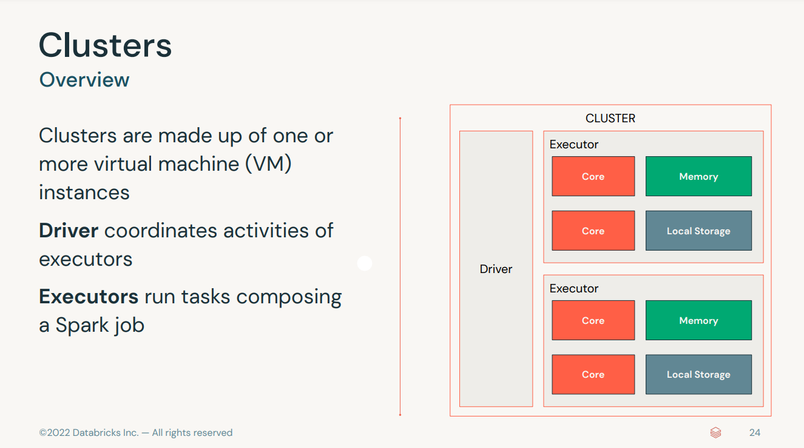

# Table of Contents - Day1

- [Table of Contents - Day1](#table-of-contents---day1)
  - [Useful links](#useful-links)
  - [Introduction](#introduction)
    - [Data Lake](#data-lake)
    - [Data Warehouse](#data-warehouse)
    - [Data Lakeouse](#data-lakeouse)
  - [Clusters](#clusters)
  - [Delta lake](#delta-lake)
  - [Databricks - Demos](#databricks---demos)
    - [DE 3.1 - Databases and Tables on Databricks](#de-31---databases-and-tables-on-databricks)
    - [DE 3.2A - Views and CTEs on Databricks](#de-32a---views-and-ctes-on-databricks)
    - [DE 4.1 - Querying Files Directly](#de-41---querying-files-directly)

## Useful links

- [data-engineer-associate-info](https://www.databricks.com/learn/certification/data-engineer-associate)
- [questions](https://www.databricks.com/learn/certification/data-engineer-associate#:~:text=the%20certification%20exam.-,Questions,-There%20are%2045)
- [practice-exams](https://files.training.databricks.com/assessments/practice-exams/PracticeExam-DataEngineerAssociate.pdf)
- [Data-Engineering-with-Databricks-|-Class-9723-|-Atos](https://partner-academy.databricks.com/learn/course/809/session/1721/data-engineering-with-databricks-class-9723-atos)
- [github-reop](https://github.com/databricks-academy/data-engineering-with-databricks-english/releases/tag/v2.3.13)

## Introduction

- Lakouse architecture wants to uniform the way we collect, transform and load data. Also it uniforms data governance

### Data Lake

- pros:
  - can store raw data
  - cheap
  - easy to scale
- cons:
  - you cannot query the data because the format it is not known

### Data Warehouse

- pros:
  - fast for reading
  - allows query and analytics because the data is well described
- cons:
  - expensive
  - hard to mantain
  - hard to scale
  - can't work with unstructered data

### Data Lakeouse

combine the best of the both of the two and it is cloud agnostic.

## Clusters

## Delta lake

[Open-source project](https://delta.io/) enables building a data lakehouse on top of existing storage systems

- software layer on top of cheap object store (s3, google drive, azure storage etc)
- it works with [.parquet](https://www.databricks.com/glossary/what-is-parquet)
  - it has a schema
- as [ACID transactions](https://www.databricks.com/glossary/acid-transactions)
- it has [time traveling](https://www.databricks.com/blog/2019/02/04/introducing-delta-time-travel-for-large-scale-data-lakes.html#:~:text=Introducing%20Time%20Travel)

## Databricks - Demos

DBU - databricks unit -> 1DBU ~ 0.20$
you can specify different workers based on what you need (memory optimized, cache optimized, GPU, etc)
a command block is only one languge (i.e., you cannot have %sql and %python in the same block)

- file closing and opening operations are costly on the cloud
  - less files is usually better
- you get one parquet file per transaction
- when deleting stuff, the file are still there, but they will be skipped during a select
- you cannot rollback after vacuum
  - vacumm ONLY DELETES PARQUET FILES
  - json file are not deleted
  - vacuum operates as a transaction, so it actually generates more json

### DE 3.1 - Databases and Tables on Databricks

- differences between Managed and UnManaged (external) tables
  - when deleting a managed table everything is deleted (even the file underlying)
  - for external tables, only the refrences to these files are deleted

- Schemas are collections of entities that can be databases
  - table schema defines the types within a schema (database)

- if you don't define a location, the default one will be used and the schema will be Managed
- to recognize an External Table
  - check if the LOCATION keyword is there
  - use DESCRIBE EXTENDED and look for Type EXTERNAL

- there is no clear indication when to use Managed or External table

- when you drop an external table, the reference to the data gets deleted, so you cannot read the data anymore
  
### DE 3.2A - Views and CTEs on Databricks

- **Views** are in memory, but you can make them permanent
  - used to "store" a subset of data from a table
  - you can use it for subqueries without having to re create it every time

- **Temporary Views** it won't survive the creation of a new session. This happen every time that
  - Restarting a cluster
  - Detaching and reataching to a cluster
  - Installing a python package which in turn restarts the Python interpreter
  - Or simply opening a new notebook

- **GLobal Temp Views**
  - to show them you need to SHOW TABLES in global_temp
  - it is global through all the compute through the clusters
  - it survives the creation of a new notebook
  - **it does not** survive the termination of a cluster (As long as the cluster is running, this database persists and any notebooks attached to the cluster can access its global temporary views.)
  - useful to share data between multiple users when streaming data, as long as they are all using the same cluster

- **Common Table Expressions**

### DE 4.1 - Querying Files Directly
